# SyNAPSE — Mermaid Diagrams (28)

Copy any block into [Mermaid Live Editor](https://mermaid.live), draw.io (Mermaid plugin), Notion, GitHub, or VS Code Markdown preview.

**Project:** SyNAPSE — Emotion-Aware AAC | MAHE Dubai  
**Note:** Charts 27–29 use values from `backend/poster_metrics.json` (local benchmark, seeded data).

---

## 1. High-Level System Architecture

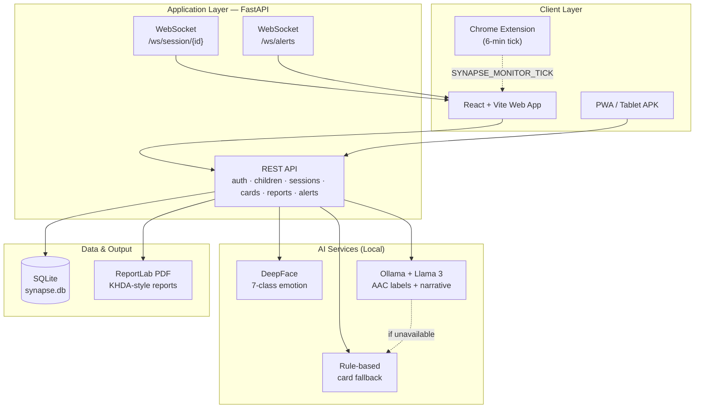

---

## 2. Layered Architecture (4 Layers)

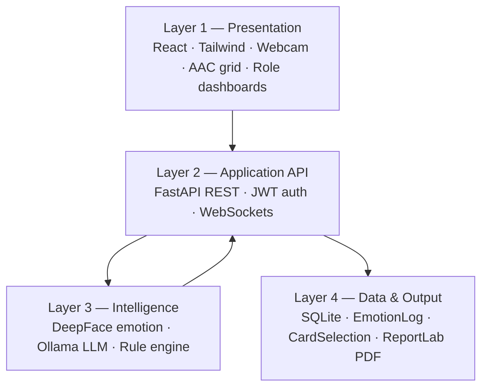

---

## 3. Deployment Architecture

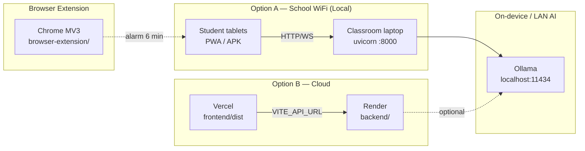

---

## 4. Backend Component Diagram

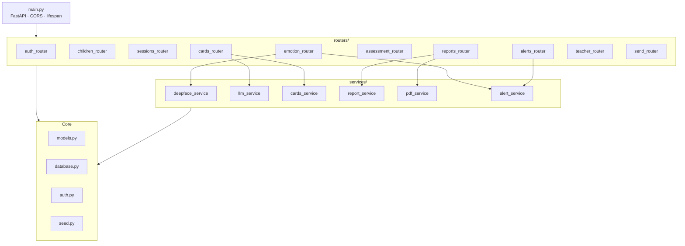

---

## 5. Frontend Component Diagram

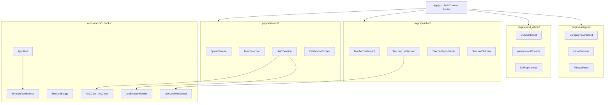

---

## 6. Technology Stack

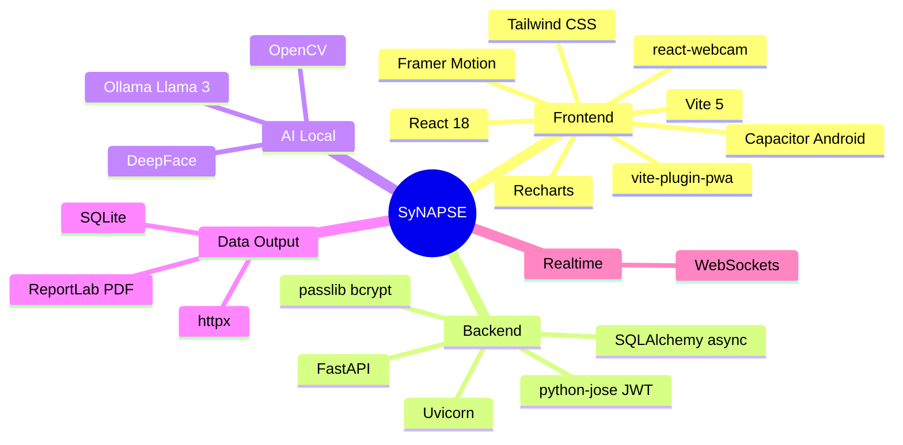

---

## 7. Entity-Relationship Diagram

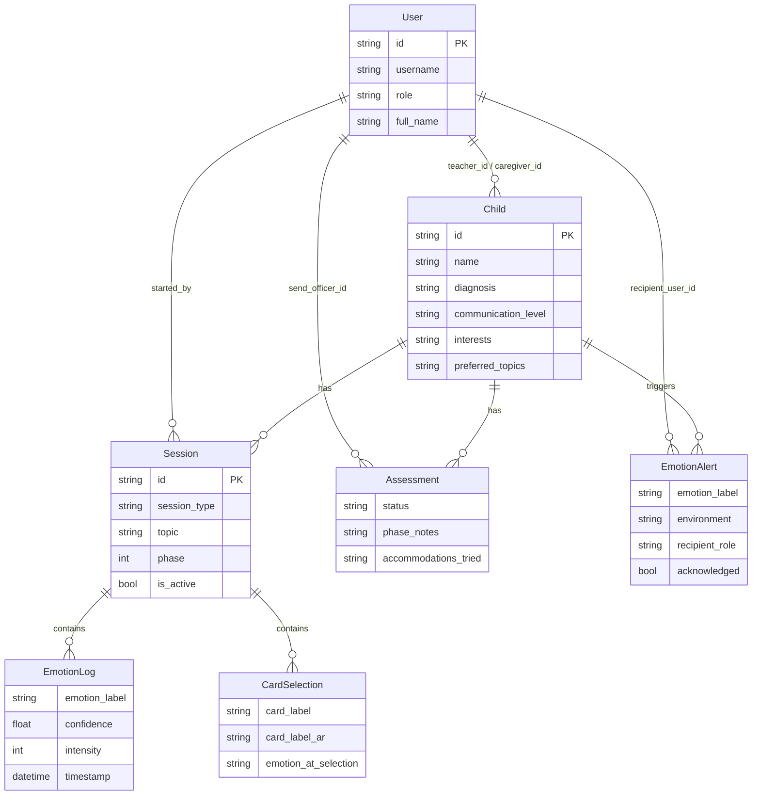

---

## 8. Emotion Data Flow (Privacy — No Video Stored)

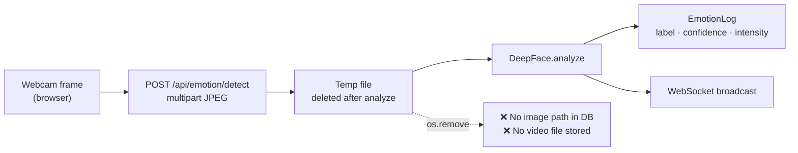

---

## 9. Session Data Model

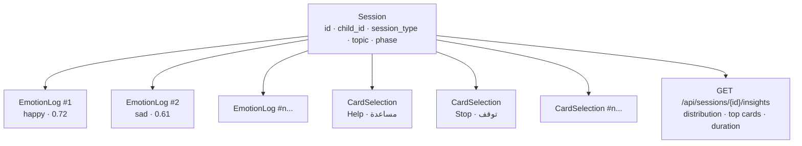

---

## 10. Seed Data Structure (Demo / Local Testing)

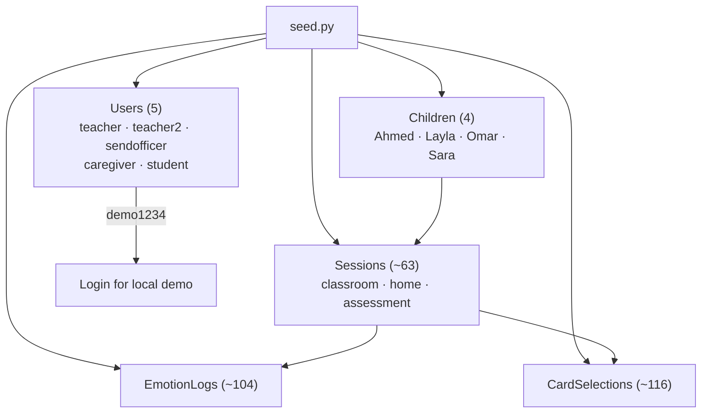

---

## 11. Student AAC Session Sequence

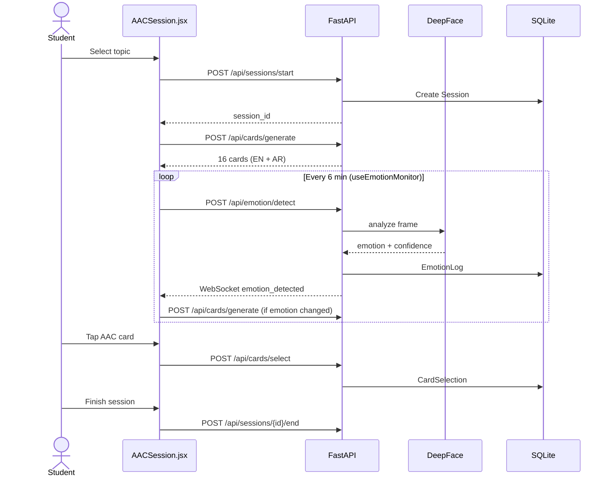

---

## 12. Emotion Detection Sequence

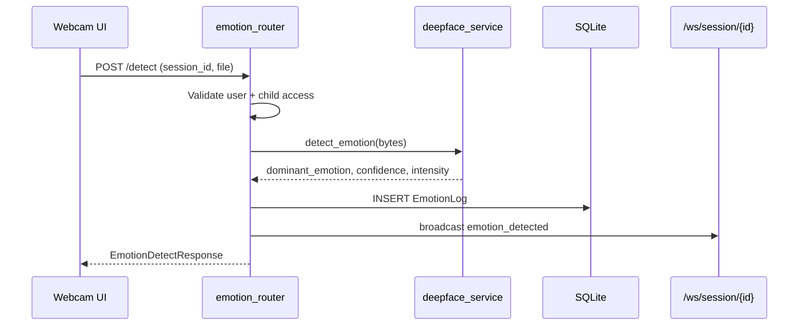

---

## 13. AAC Card Generation Sequence

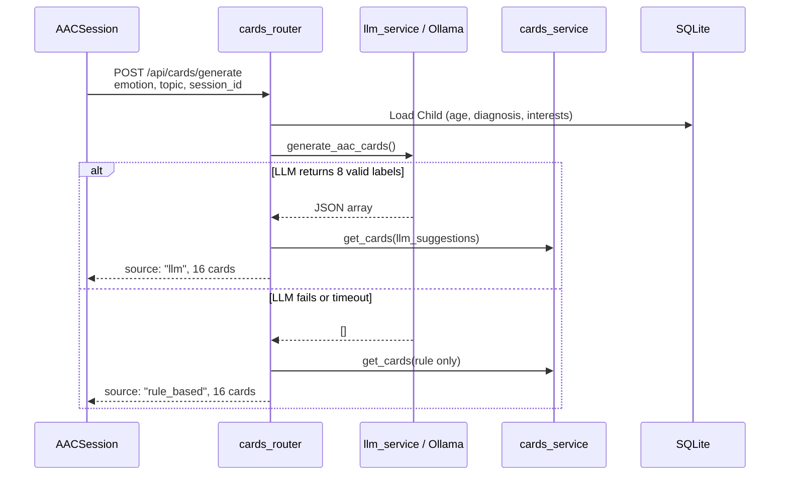

---

## 14. Six-Minute Background Monitor Flow

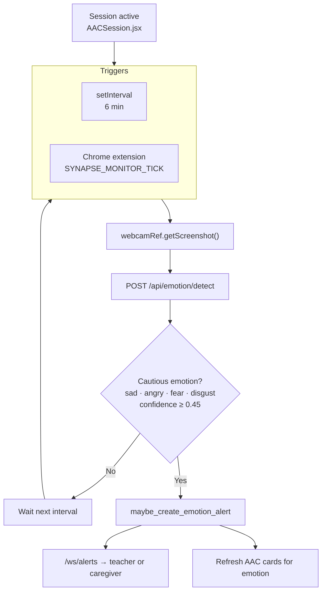

---

## 15. Alert Routing Flow (School vs Home)

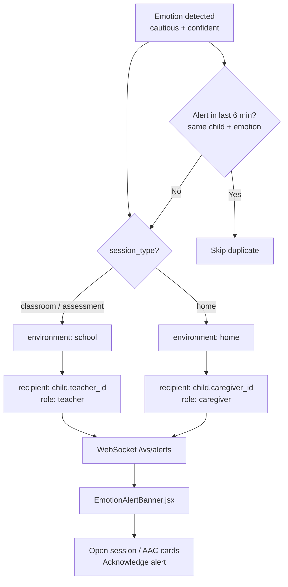

---

## 16. Teacher Live View Sequence

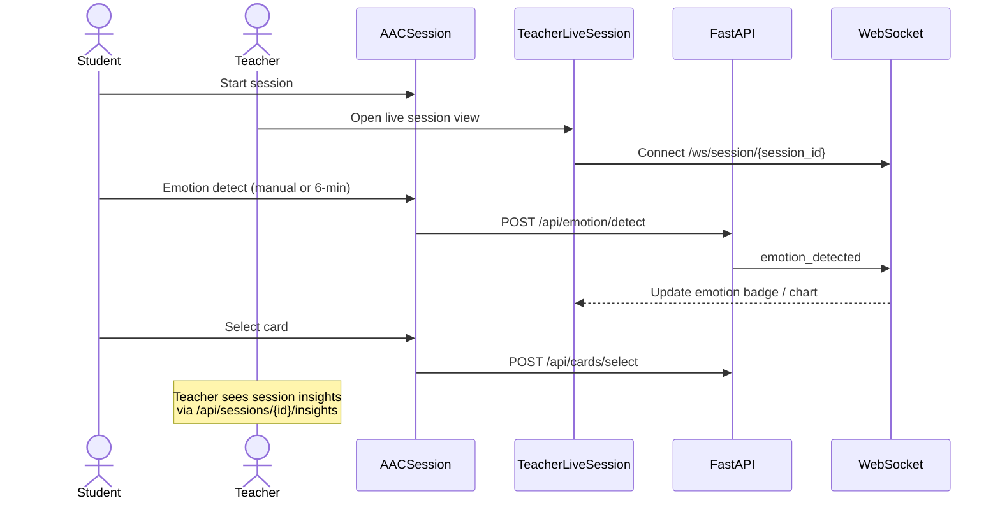

---

## 17. PDF Report Generation Sequence

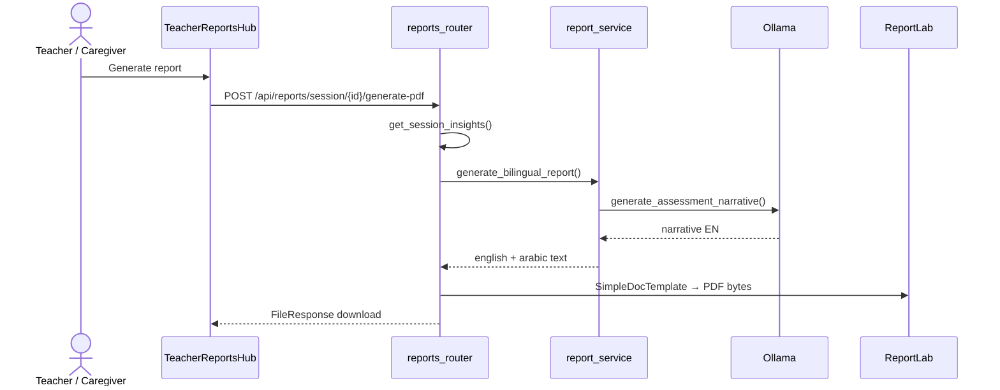

---

## 18. Four-Role Ecosystem

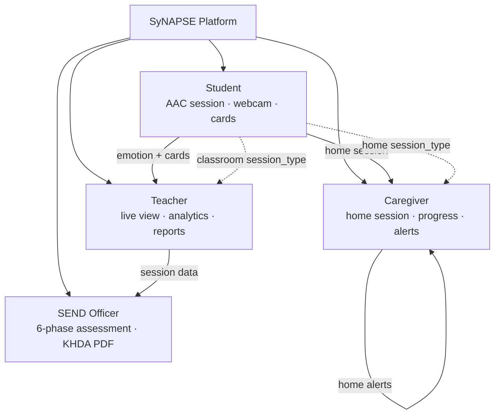

---

## 19. Student UI Flow

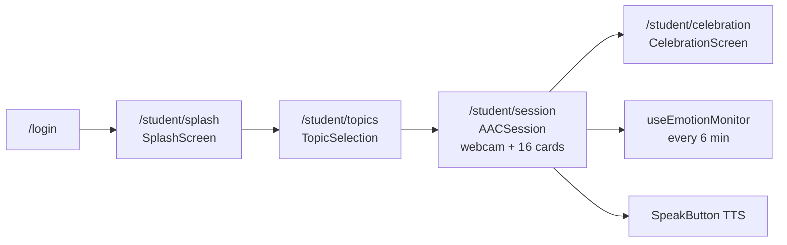

---

## 20. Teacher UI Map

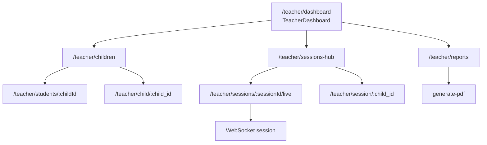

---

## 21. SEND Officer UI Map

```mermaid
flowchart TB
  SD["/send-officer/dashboard<br/>SODashboard"]
  SD --> SC["/send-officer/children"]
  SD --> AS["/send-officer/assessments"]
  SD --> RH["/send-officer/reports-hub"]

  AS --> AC["/send-officer/assessment/:id<br/>AssessmentConsole"]
  AC --> P1["Phase 1 Identification"]
  AC --> P2["Phase 2 Assessment"]
  AC --> P3["Phase 3 Planning"]
  AC --> P4["Phase 4 Implementation"]
  AC --> P5["Phase 5 Monitoring"]
  AC --> P6["Phase 6 Review"]

  RH --> RV["/send-officer/report/:id<br/>ReportViewer"]
  RH --> KHDA["khda-school-report PDF"]
```

---

## 22. Caregiver UI Map

```mermaid
flowchart TB
  CD["/caregiver/dashboard<br/>CaregiverDashboard"]
  CD --> HS["/caregiver/session<br/>HomeSession · session_type: home"]
  CD --> PV["/caregiver/progress<br/>ProgressView"]
  CD --> PR["/caregiver/privacy<br/>PrivacyPanel"]
  CD --> SET["/caregiver/settings"]

  HS --> ALERT["Receives /ws/alerts<br/>when child at home"]
```

---

## 23. KHDA Six-Phase SEND Stepper

```mermaid
flowchart LR
  P1["1 Identification"]
  P2["2 Assessment of<br/>Educational Need"]
  P3["3 Planning<br/>IEP / PLP"]
  P4["4 Implementation"]
  P5["5 Monitoring"]
  P6["6 Review"]

  P1 --> P2 --> P3 --> P4 --> P5 --> P6

  P1 -.-> N1["phase_notes JSON<br/>AssessmentConsole"]
  P2 -.-> N2["SyNAPSE assessment session"]
  P5 -.-> N5["Session analytics · emotion logs"]
  P6 -.-> N6["PDF report · KHDA summary"]
```

---

## 24. SyNAPSE ↔ KHDA Evidence Mapping

```mermaid
flowchart TB
  subgraph KHDA["KHDA SEND Phases"]
    K1["Identification"]
    K2["Assessment"]
    K3["Planning"]
    K4["Implementation"]
    K5["Monitoring"]
    K6["Review"]
  end

  subgraph SYN["SyNAPSE Features"]
    F1["Child profile · diagnosis · communication_level"]
    F2["AssessmentConsole · 6 phases"]
    F3["AAC board · bilingual cards"]
    F4["Student/teacher sessions · live WS"]
    F5["EmotionLog · CardSelection · insights"]
    F6["ReportLab PDF · khda-school-report"]
  end

  K1 --- F1
  K2 --- F2
  K3 --- F3
  K4 --- F4
  K5 --- F5
  K6 --- F6
```

---

## 25. SDG Alignment Hub

```mermaid
flowchart TB
  SYN["SyNAPSE<br/>Emotion-Aware AAC"]

  SYN --> SDG3["SDG 3<br/>Good Health & Well-Being<br/>Emotion-aware support · alerts"]
  SYN --> SDG4["SDG 4<br/>Quality Education<br/>Inclusive AAC · SEND workflows"]
  SYN --> SDG10["SDG 10<br/>Reduced Inequalities<br/>Voice for minimally verbal children"]
```

---

## 26. End-to-End Pipeline (Core Contribution)

```mermaid
flowchart LR
  A["Webcam"] --> B["DeepFace<br/>7 emotions"]
  B --> C{"Cautious?"}
  C -->|Yes| D["Alert<br/>teacher / caregiver"]
  C -->|No| E["Continue monitor"]
  B --> F["Ollama / Rules<br/>16 AAC cards"]
  F --> G["Student taps card<br/>EN + AR + TTS"]
  G --> H["CardSelection log"]
  B --> H
  H --> I["ReportLab PDF<br/>KHDA-style"]
  D --> G
```

---

## 27. API Latency Benchmark (Local)

```mermaid
xychart-beta
  title "SyNAPSE Local API Latency (seconds)"
  x-axis ["Emotion detect", "PDF report", "AAC generate (rule)"]
  y-axis "Seconds" 0 --> 26
  bar [0.303, 1.843, 24.612]
```

*Source: `backend/poster_metrics.json` — AAC LLM row is rule_based fallback timing; label honestly in caption.*

---

## 28. Seeded Demo Dataset Counts

```mermaid
xychart-beta
  title "SQLite Seed Data (synapse.db)"
  x-axis ["Sessions", "Emotion logs", "Card selections"]
  y-axis "Count" 0 --> 120
  bar [63, 104, 116]
```

*Source: `backend/poster_metrics.csv` — demo data from `seed.py`, not field collection.*

---

## Bonus: Feature Comparison (Table as Mermaid)

```mermaid
flowchart TB
  subgraph Static["Static AAC Apps"]
    A1["Fixed boards"]
    A2["No emotion"]
    A3["No SEND reports"]
  end

  subgraph Cloud["Cloud AAC + Emotion"]
    B1["Subscription / API cost"]
    B2["Video often cloud-processed"]
    B3["Limited KHDA workflow"]
  end

  subgraph Synapse["SyNAPSE (this project)"]
    C1["16 adaptive cards EN/AR"]
    C2["DeepFace + 6-min monitor"]
    C3["4 roles · WebSocket alerts"]
    C4["Local-first · no video stored"]
    C5["KHDA PDF · 6-phase assessment"]
  end
```

---

## Bonus: WebSocket Dual-Channel Architecture

```mermaid
flowchart TB
  subgraph Channels["WebSocket Channels"]
    CH1["/ws/session/{session_id}<br/>ConnectionManager"]
    CH2["/ws/alerts?token=JWT<br/>UserAlertManager"]
  end

  CH1 --> U1["Student session UI"]
  CH1 --> U2["TeacherLiveSession"]
  CH2 --> U3["Teacher AppShell"]
  CH2 --> U4["Caregiver AppShell"]

  EM["emotion_router<br/>emotion_detected"] --> CH1
  AL["alert_service<br/>emotion_alert"] --> CH2
```

---

## Bonus: AAC Board Composition (16 Cards)

```mermaid
pie showData
  title AAC Board Layout (get_cards)
  "Core (8)" : 8
  "Emotion (4)" : 4
  "Topic (4)" : 4
```

---

## Usage tips

| Tool | How |
|------|-----|
| **mermaid.live** | Paste one block → Export PNG/SVG |
| **VS Code** | Markdown preview with Mermaid extension |
| **Word report** | Export SVG from mermaid.live → Insert image |
| **Poster** | Export 300 DPI PNG; diagrams 1, 11, 18, 23, 25, 27, 28 recommended |

**Caption for all evaluation charts:** *Prototype testing on seeded local data (`seed.py`); no user surveys or field data collection conducted.*
